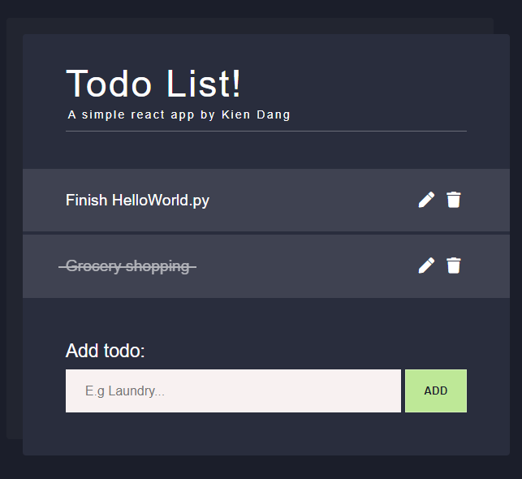

## React To do List

A simple React To do list.

  <a href="https://kien-react-todo.netlify.com/">Live Demo</a>

  

## 👨‍🎓What I learned:

- React forms and how they work
- Common React design patterns involving forms
- UUIDv4 library to assign unique IDs to tasks
- Changing state and updating state using `setState()`
- Manipulate data arrays in state
- Passing props from parent to child
- Invoking methods from child to parent (data upward flow)

## Codepen CSS:

CSS Style came from Sawsan's [Codepen](https://codepen.io/saawsan/pen/jayzeq)

Color palette from [Material Design Palenight](https://github.com/material-theme/vsc-material-theme)
